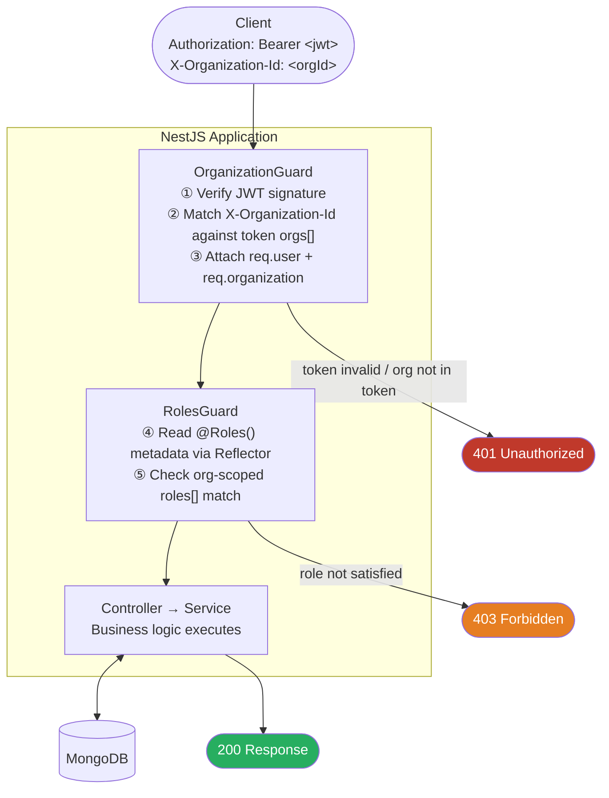
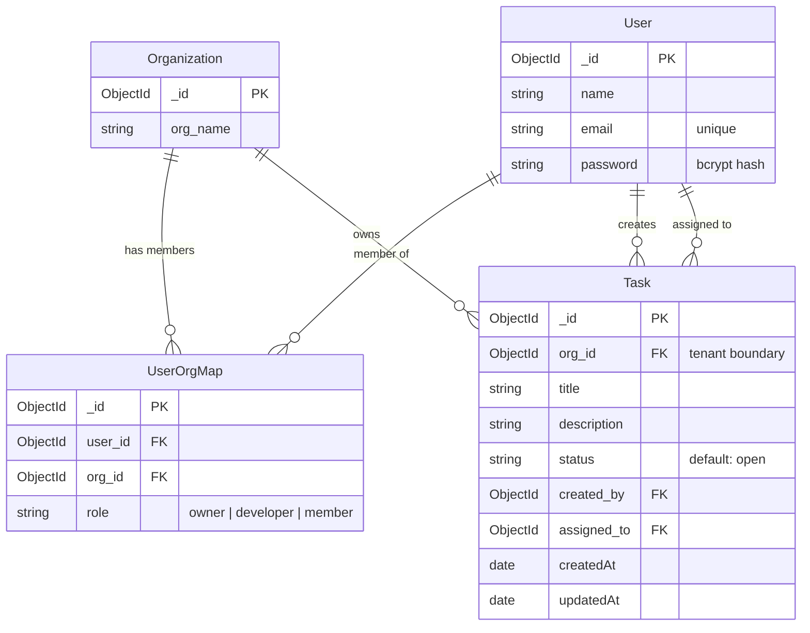
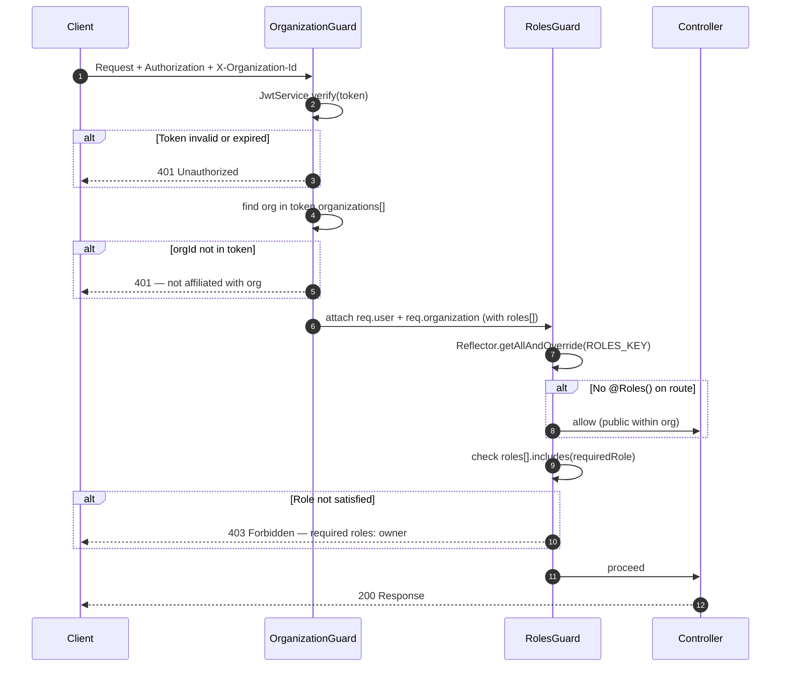

# Multi-Tenant Auth API

A production-ready REST API implementing **multi-tenancy**, **JWT authentication**, and **organization-scoped Role-Based Access Control (RBAC)** — built with NestJS, MongoDB, and TypeScript.

> Designed to reflect the kind of auth layer a real SaaS backend requires: one user, many organizations, different roles in each.

---

## Tech Stack

| Layer | Technology |
|---|---|
| Framework | NestJS 11 (modular, dependency-injected) |
| Language | TypeScript 5 (strict mode) |
| Database | MongoDB via Mongoose ODM |
| Auth | JWT (JSON Web Tokens) + bcrypt |
| Validation | class-validator + class-transformer |
| API Docs | Swagger UI + Scalar API Reference |
| Runtime | Node.js / Bun compatible |

---

## The Problem This Solves

Standard auth tutorials issue a token and stop there. Real multi-tenant SaaS applications need more:

- A **single user identity** that can belong to multiple organizations
- **Different roles per organization** (e.g. `owner` in Org A, `developer` in Org B)
- **Every API request scoped to the active tenant** to prevent cross-tenant data leakage
- A **membership table** (join table) rather than embedding roles on the user directly

This project implements all of the above as a clean, layered backend service.

---

## Architecture

Every inbound HTTP request passes through a two-layer guard pipeline before reaching business logic. Guards are NestJS `CanActivate` classes that run in order — if either throws, the request is rejected before any service code runs.



---

## Data Model

Three MongoDB collections following a **relational mapping pattern** in a document database. The `UserOrgMap` collection acts as a join table, enabling one user to hold completely independent roles across many organizations.



**Key design decisions:**
- Roles live on `UserOrgMap`, not on `User` — the same person can be `owner` in Org A and `developer` in Org B
- Compound unique index on `(user_id, org_id)` enforces at the database level that no duplicate memberships exist
- `Task.org_id` is a hard tenant boundary — a task can never be read or written across organizations

---

## Authentication Flow

### Register + Login

```mermaid
sequenceDiagram
    autonumber
    participant C  as Client
    participant A  as AuthController
    participant S  as AuthService
    participant DB as MongoDB
    participant J  as JwtService

    rect rgb(30, 50, 80)
        Note over C,J: POST /auth/register
        C->>A: { name, email, password, org_name }
        A->>S: register(dto)
        S->>DB: findOne(User, { email })
        alt User already exists
            S->>S: bcrypt.compare(password, hash)
            note right of S: lets existing users join new orgs
        else New user
            S->>S: bcrypt.hash(password, 10 rounds)
            S->>DB: create User
        end
        S->>DB: findOne(Organization, { org_name })
        alt Organization exists
            S->>S: role = "member"
        else New organization
            S->>DB: create Organization
            S->>S: role = "owner"
        end
        S->>DB: create UserOrgMap { user_id, org_id, role }
        S-->>C: { message: "Registered as &lt;role&gt;" }
    end

    rect rgb(20, 60, 50)
        Note over C,J: POST /auth/login
        C->>A: { email, password }
        A->>S: login(dto)
        S->>DB: findOne(User, { email })
        S->>S: bcrypt.compare(password, hash)
        S->>DB: find UserOrgMap[] populate org_id
        S->>S: merge duplicate (user,org) pairs → roles[]
        S->>J: sign({ sub, email, organizations[] })
        J-->>S: access_token (1h expiry)
        S-->>C: { access_token }
    end
```

### Protected Request (Guard Pipeline)



The JWT embeds the full membership list so `OrganizationGuard` can validate tenant access with **zero extra database round-trips** on every request.

---

## Authorization Design

### OrganizationGuard

Implemented as a NestJS `CanActivate` guard. On every protected request it:

1. Reads and verifies `Authorization: Bearer <token>` using `JwtService.verify()` (signature always validated — never `.decode()`)
2. Reads the `X-Organization-Id` header
3. Finds the matching org entry inside the token `organizations[]` array
4. Attaches `req.user` and `req.organization` (including org-scoped roles) to the request

### RolesGuard

Uses NestJS `Reflector` to read metadata set by the `@Roles()` custom decorator, then checks whether any of the user org-scoped `roles[]` satisfy the requirement. Always composed after `OrganizationGuard` so tenant context is guaranteed to be present.

```typescript
@UseGuards(OrganizationGuard, RolesGuard)
@Roles('owner')
assignUserToOrganization(...) { ... }
```

---

## API Reference

Interactive documentation is available when the server is running:

| Interface | URL |
|---|---|
| Swagger UI | `http://localhost:3000/docs` |
| Scalar API Reference | `http://localhost:3000/reference` |
| OpenAPI JSON | `http://localhost:3000/docs-json` |

### Endpoints

#### Auth

| Method | Route | Guard | Description |
|---|---|---|---|
| `POST` | `/auth/register` | None | Register a user and create or join an organization |
| `POST` | `/auth/login` | None | Authenticate and receive a JWT access token |
| `GET` | `/auth/organization-details` | JWT + Org | Return active user and org context |
| `POST` | `/auth/org/assign-user` | JWT + Org + `owner` role | Assign a user to the active org with a given role |

#### Tasks

| Method | Route | Guard | Description |
|---|---|---|---|
| `POST` | `/tasks` | JWT + Org + `developer` role | Create a task scoped to the active organization |

### Required Headers (protected routes)

```
Authorization: Bearer <access_token>
X-Organization-Id: <org_id>
```

### Quick-Start Example

```bash
# 1. Register — creates the org; caller gets role=owner
curl -X POST http://localhost:3000/auth/register \
  -H "Content-Type: application/json" \
  -d '{"name":"Alice","email":"alice@acme.com","password":"secret","org_name":"Acme"}'

# 2. Login
curl -X POST http://localhost:3000/auth/login \
  -H "Content-Type: application/json" \
  -d '{"email":"alice@acme.com","password":"secret"}'
# Returns: { "access_token": "eyJ..." }

# 3. Access a protected route
curl http://localhost:3000/auth/organization-details \
  -H "Authorization: Bearer <access_token>" \
  -H "X-Organization-Id: <org_id>"
```

---

## Project Structure

```
src/
+-- main.ts                         # Bootstrap: Swagger + Scalar setup
+-- app.module.ts                   # Root module, Mongoose connection
+-- auth/
|   +-- auth.controller.ts          # Auth routes
|   +-- auth.service.ts             # Business logic (register, login, assign)
|   +-- auth.module.ts              # Module wiring
|   +-- guards/
|   |   +-- organization.guard.ts   # JWT verification + tenant validation
|   |   +-- roles.guard.ts          # Org-scoped RBAC check
|   +-- decorators/
|   |   +-- roles.decorator.ts      # @Roles() custom metadata decorator
|   +-- dto/
|       +-- login.dto.ts
|       +-- register.dto.ts
+-- schemas/
|   +-- user.schema.ts
|   +-- organization.schema.ts
|   +-- user-org-map.schema.ts      # Membership join table + compound index
+-- tasks/
    +-- tasks.controller.ts
    +-- tasks.service.ts
    +-- tasks.module.ts
    +-- task.schema.ts              # Org-scoped task document
    +-- dto/create-task.dto.ts
```

---

## Running Locally

**Prerequisites:** Node.js 20+ and MongoDB running on `localhost:27017`

```bash
# Install dependencies
npm install

# Start in development mode (watch)
npm run start:dev

# Production build
npm run build && npm run start:prod
```

Override the default port:

```bash
PORT=4000 npm run start:dev
```

---

## Key Engineering Concepts Demonstrated

| Concept | Implementation |
|---|---|
| Multi-tenancy via join table | `UserOrgMap` schema — roles scoped per (user, org) pair |
| Database-level constraint enforcement | Compound unique index on `(user_id, org_id)` in Mongoose |
| Stateless auth with embedded claims | JWT encodes full org membership list at login time |
| Guard composition + request context propagation | `OrganizationGuard` -> `RolesGuard` pipeline |
| Metadata-driven RBAC | `@Roles()` custom decorator + `Reflector` in `RolesGuard` |
| Secure password storage | bcrypt with 10 salt rounds |
| Input validation at system boundary | `class-validator` decorators on all DTO classes |
| API documentation | OpenAPI spec via `@nestjs/swagger`, surfaced through Swagger UI and Scalar |
| Modular NestJS architecture | `AuthModule`, `TasksModule` — independently importable feature modules |
